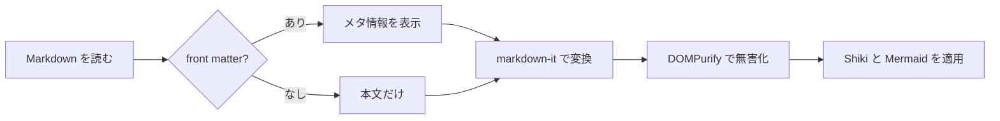
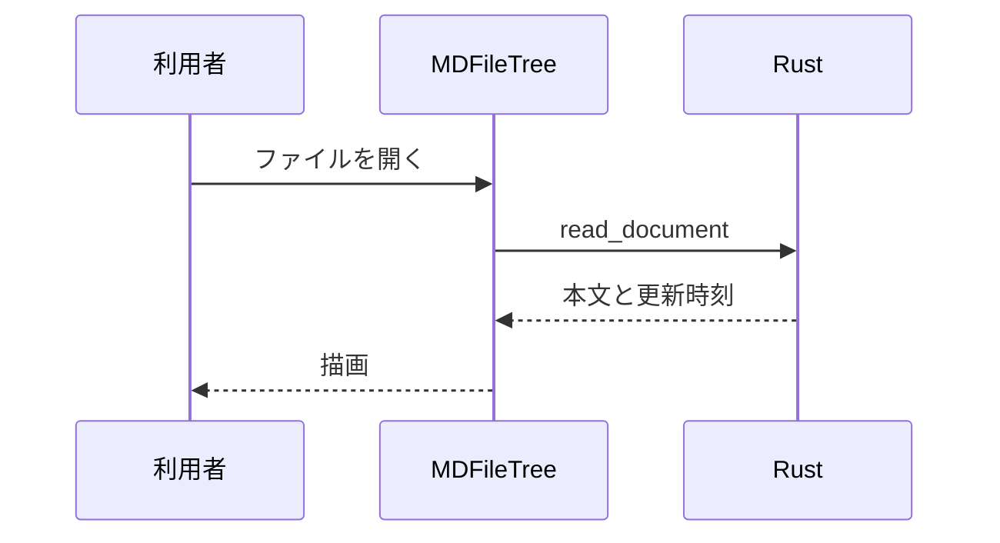

# 記法の総合確認

表以外の記法がひととおり描画されるかを見るためのファイルです。
[表の再現テスト](./tables.md) も合わせて確認してください。

## 見出しと本文

### 第 3 レベル

#### 第 4 レベル

##### 第 5 レベル

###### 第 6 レベル

段落は空行で区切ります。**太字**、*斜体*、***太字斜体***、~~打ち消し~~、
==ハイライト==、++下線++、H~2~O、x^2^、`インラインコード`、<kbd>⌘</kbd> + <kbd>F</kbd>。

自動リンク: https://www.markdownguide.org/ と <tenma@example.com>。

*[HTML]: HyperText Markup Language

HTML は略語の例です（マウスを乗せると説明が出ます）。

## リスト

- 箇条書き
  - 入れ子
    - さらに入れ子
- ふたつめ

1. 番号付き
2. ふたつめ
   1. 入れ子
   2. その次

- [x] 完了したタスク
- [ ] これからのタスク
- [ ] さらにもうひとつ

## 定義リスト

Markdown
: 文書を書くための軽量マークアップ言語。

Tauri
: Rust 製のデスクトップアプリ用フレームワーク。
: webview を使って画面を描く。

## 引用

> 引用の中に **強調** や `コード` を書けます。
>
> > 入れ子の引用。

## GitHub 形式の注意書き

> [!NOTE]
> 補足情報です。読み飛ばしても本筋は追えます。

> [!TIP]
> 知っていると作業が楽になる小技です。

> [!IMPORTANT]
> 目的を達成するために必要な情報です。

> [!WARNING]
> 見落とすと問題が起きる可能性があります。

> [!CAUTION]
> 危険な操作についての注意です。

## コード

インラインは `const answer = 42` のように書きます。

```typescript
interface Document {
  path: string
  content: string
}

export function summarize(doc: Document): string {
  const lines = doc.content.split('\n')
  return `${doc.path}: ${lines.length} 行`
}
```

```rust
#[tauri::command]
fn read_document(path: String) -> Result<String, String> {
    std::fs::read_to_string(&path).map_err(|e| e.to_string())
}
```

```python
from dataclasses import dataclass


@dataclass
class Item:
    name: str
    count: int = 0

    def label(self) -> str:
        return f"{self.name} x{self.count}"
```

```sh
pnpm tauri dev
```

```
言語指定のないブロックは、そのままの体裁で表示されます。
	タブも保たれます。
```

## 数式

インライン数式は $a^2 + b^2 = c^2$ のように書きます。

別行立ての数式:

$$
\int_{-\infty}^{\infty} e^{-x^2}\,dx = \sqrt{\pi}
$$

$$
\begin{pmatrix}
a & b \\
c & d
\end{pmatrix}
\begin{pmatrix}
x \\
y
\end{pmatrix}
=
\begin{pmatrix}
ax + by \\
cx + dy
\end{pmatrix}
$$

## 図（Mermaid）





## 画像

相対パスの画像:


存在しない画像（読み込み失敗の見え方の確認）:


## 脚注

本文に脚注を付けられます[^1]。複数でも大丈夫です[^note]。

[^1]: これが1つめの脚注です。
[^note]: 名前付きの脚注も使えます。**装飾**も効きます。

## 絵文字

:smile: :rocket: :books: :white_check_mark:

## 区切り線

---

## 属性の指定 {#custom-anchor}

見出しには `{#id}` で任意のアンカーを付けられます。
上の見出しへは [#custom-anchor](#custom-anchor) で移動できます。

## 長い本文

読み進めたときに目次が追従するかを見るための繰り返しです。

### 節 A

Markdown リーダーは、書いたとおりに読めることが何より大切です。
とくに表は情報の密度が高く、崩れるとその場で意味を失います。

### 節 B

段組みや結合セルを含む表でも、元の構造が保たれているかどうかを確認します。

### 節 C

コードや数式、図が混ざっていても、読みやすさが落ちないことを目指しています。

### 節 D

最後の節です。ここまでスクロールすると、目次の選択位置もここになります。
